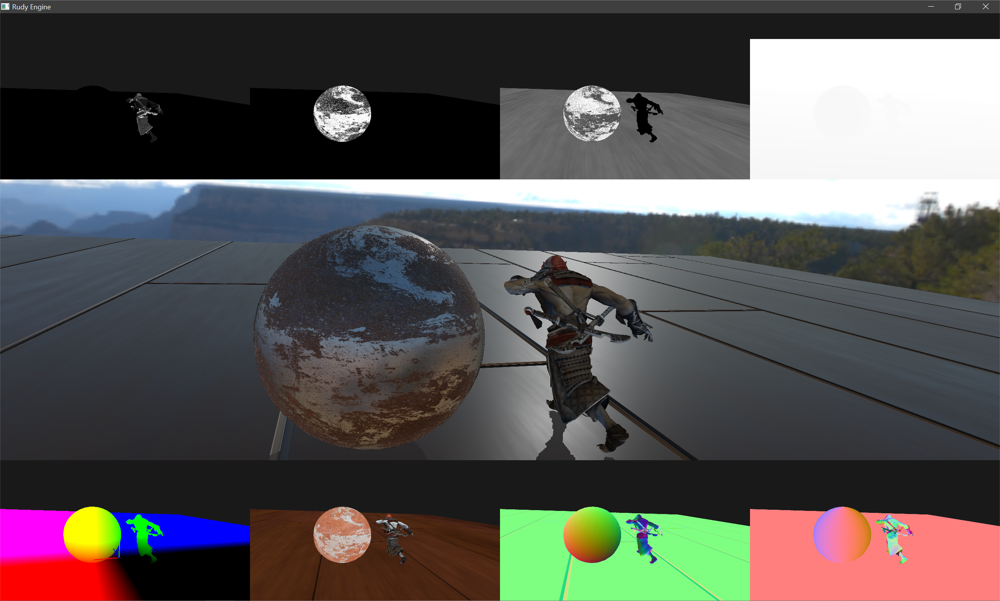

# a GPU-based renderer
This is a rendering engine in development , primarily for educational purposes.
By separating the front-end framework and back-end implementation,  I find it helps to understand both theoretic and engineering aspects of computer graphics.
I try to keep the code understandable and maintainable, such that it's easy to modify, and implement new ideas in the future.
 
## Major implementations.
* Deferred rendering
* Physically based rendering
* Image-based lighting  
* Skeletal animation
* Post-processing 

## Snapshot
The buffers in the following snapshot are relatively：  
* gSpecular ,gMetallic ,gRoughness, gScreenDepth, 
* gPosition , gAlbedo ,gWorldNormal, gWorldTangent. 

