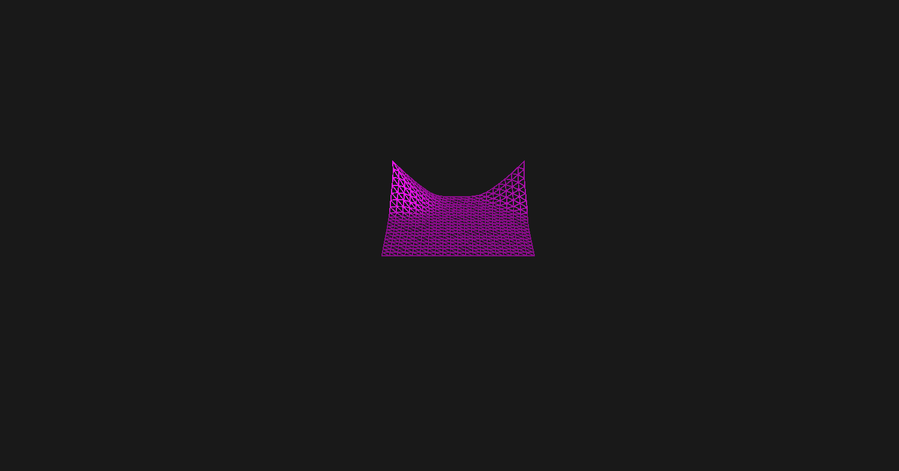

# a GPU-based renderer
This is a rendering engine in development, primarily for educational purposes.
I have been trying to keep the code understandable and maintainable, such that it's easy to implement ideas and to customize complicated pipeline.
Source codes of the following demos can be found in the 'App' folder.

## Prerequisite
This is a visual studio project runs on Windows,  and relying on NVIDIA graphics cards for atomic float operations.

## Major implementations.　
 実装した項目
* Deferred rendering
* Physically based rendering
* Image-based lighting  
* Skeletal animation
* Post-processings(Bloom,Outline,SSAO,SSR)
* NPR pipeline
* GPU particles
* GPU cloth

## Snapshots
### PBR
Physically based Material with gbuffer visualization.
The buffers in the following are relatively：  
* Metallic , Roughness, ViewDepth, ShadowMap  
* Position , WorldNormal, gWorldTangent, Albedo  

### NPR
A basic non-photorealistic rendering pipeline.
* cel shading
* face shadow by lightmap
* Postprocessings(Bloom,Outline)

* the flow chart using Blender

### GPU particles
* lifetime management
* camera-facing sprites

### GPU cloth
* by PBD(position-based dynamics) 

## Roadmap
これからやりたいこと
* Build methods & Documentation (after the framework is stablized)
* Temporal techniques (TAA, temporal denoising)
* MMD animations with physics
* Particle sorting/Collision handling
* SoftBody simulation
* Fluid simulation 
* Volume rendering
* Subsurface scattering

## Dependencies
* [spdLog](https://github.com/gabime/spdlog)
* [Glad](https://glad.dav1d.de/) 
* [GLFW](https://www.glfw.org/) 
* [GLM](https://github.com/g-truc/glm)
* [stb](https://github.com/nothings/stb)
* [assimp](https://github.com/assimp/assimp)
* [Dear ImGui](https://github.com/ocornut/imgui)
